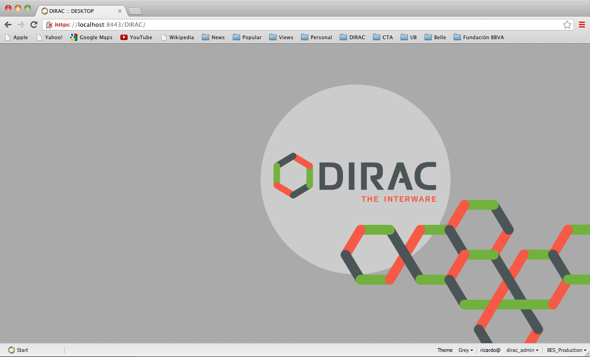
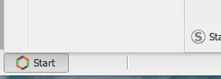

# Introduction to DIRAC WebApp

DIRAC WebApp project aims to produce the new Web Interface for the [DIRAC Project](http:/diracgrid.org). While partially keeping some concepts from the old [DIRAC Web](https://github.com/DIRACGrid/DIRACWeb) interface, it does include some new ideas to make more comfortable your DIRAC experience.

When you first connect to it, the new WebApp interface provides you with an empty Desktop-like page:

At the bottom left corner there is a "Start" button:

 

while at the bottom right corner you will find controls to select the "Group" and "Setup" you want to use:

.

Each supported functionality is implemented as an **Application** that can be executed on your **Desktop**. Applications are launched from the "Start" button, where you can also load a previously saved state of the application (place your mouse on the application name and wait for the available states to be displayed).

The currently available Applications are:
* Job Monitor: To monitor and manage your jobs. It includes a selection panel and 2 display options: a tabular and a graphic.
* Pilot Monitor: To monitor the submitted pilots. It includes a selection panel and a tabular display.
* Accounting: To generate Accounting reports. It includes a selection panel and a graphic display.
* Configuration Manager: To view and edit the Configuration information. It includes a configuration browser and a edition panel when in Manage mode.
* File Catalog: To query the FileCatalog. It includes a file catalog browser, metadata selection and display panels, and tabular display of selected LFNs. 
* Job Launchpad Tool: simple and powerful tool for job submission.
* Proxy Delegation Tool: 

***

